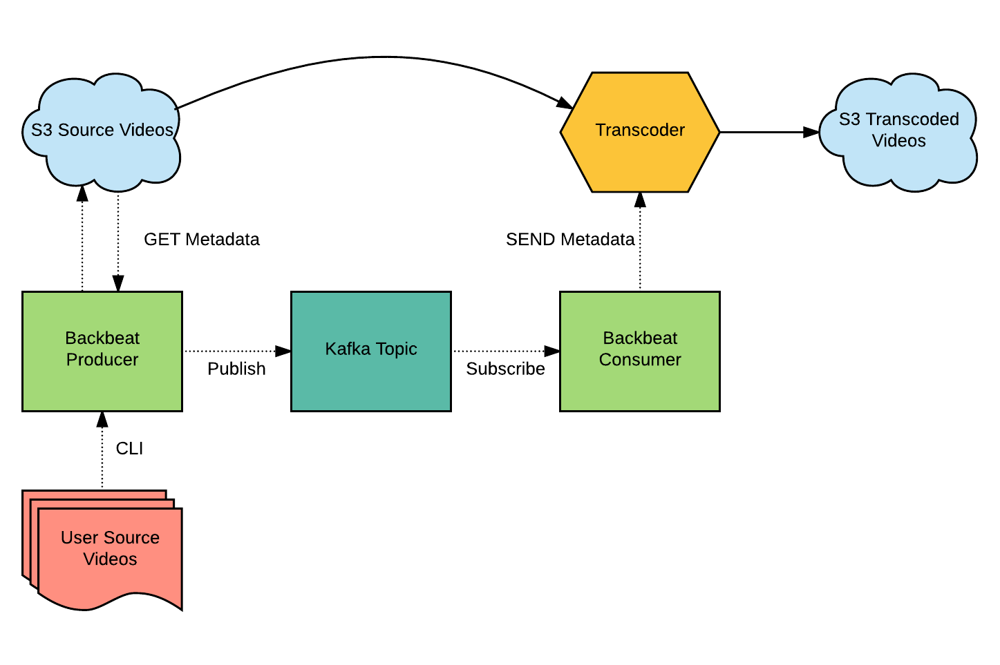

# Video Transcoding
A Zenko Backbeat Module



## Overview
Many websites like Youtube stream each video in a variety of formats to support all kinds of devices and all you have to do is upload once.  We aim to provide an open source solution to enable others to do the same.  This module automates video transcoding over S3 buckets using Backbeat to dispatch work to a long-running transcoder.

Won 3rd place for Scality's Hackaton.  For future development, we intend to make this a full fledged Zenko Backbeat extension.

Check out the [Zenko Blog Post](http://www.zenko.io/blog/video-automating-video-transcoding/)!

## Local Quickstart

This guide assumes the following:
* Using MacOS
* `brew` is installed. (https://brew.sh/)
* `node` is installed (v6.9.5)
* `npm` is installed (3.10.10)
* `aws` is installed (aws-cli/1.11.1)


### Run kafka and zookeeper locally

#### Install kafka and zookeeper

```
brew install kafka && brew install zookeeper
```

Make sure you have `/usr/local/bin` in your `PATH` env variable (or wherever your homebrew programs are installed):

```
echo 'export PATH="$PATH:/usr/local/bin"' >> ~/.bash_profile
```

#### Start kafka and zookeeper servers

```
mkdir ~/kafka && \
cd ~/kafka && \
curl http://apache.claz.org/kafka/0.11.0.0/kafka_2.11-0.11.0.0.tgz | tar xvz && \
sed 's/zookeeper.connect=.*/zookeeper.connect=localhost:2181\/backbeat/' \
kafka_2.11-0.11.0.0/config/server.properties > \
kafka_2.11-0.11.0.0/config/server.properties.backbeat
```

Start the zookeeper server:

```
zookeeper-server-start ~/kafka/kafka_2.11-0.11.0.0/config/zookeeper.properties
```

In a new shell, start the kafka server:

```
kafka-server-start ~/kafka/kafka_2.11-0.11.0.0/config/server.properties.backbeat
```

#### Create a zookeeper node and kafka topic

In a new shell, connect to the zookeeper server with the ZooKeeper chroot `/backbeat` path:

```
zkCli -server localhost:2181/backbeat
```

Create the `producer-test-topic` node:

```
create /populator my_data
```

We may leave the zookeeper server now:

```
quit
```

Create the `producer-test-topic` topic:

```
kafka-topics --create \
--zookeeper localhost:2181/backbeat \
--replication-factor 1 \
--partitions 1 \
--topic producer-test-topic
```

#### Setup video transcoding with backbeat

In a new shell, clone backbeat:

```
git clone https://github.com/andeaseme/backbeat/ ~/backbeat && \
cd ~/backbeat && \
npm install
```
#### Setup S3 Buckets JSON
Set your source and destination buckets in `bucket.json`
```
{
	"src" : "Source_Bucket",
	"destiny" : "Destination_Bucket",
	"output_types" : {
		"type1" : "m4v",
		"type2" : "mp4",
		"type3" : "mkv"
	}
}
```

#### Start consumer
```
node consumer.js
```
The consumer will wait for a task to be queued then download the file, transcode video, upload to destination bucket.
#### Start producer with CLI

In a new shell, start producer
```
node producer.js spacetestSMALL.wmv
```
The producer will upload the video to the source bucket and queue up a task for the consumer.
#### Start producer as long running watcher task

In a new shell, start producer
```
node producer.js
```
Upload video files to your S3 `Source_Bucket\raw\'.`  NOTE: raw directory in bucket

## Zenko Backbeat

Please refer to ****[Scality's Zenko Backbeat](https://github.com/scality/backbeat)****

## Contributors
- [Andie Shining Phan](https://github.com/andeaseme) 
- [Wiley Debs](https://github.com/Colortear) 
- [Robert Passafaro](https://github.com/blockco) 
